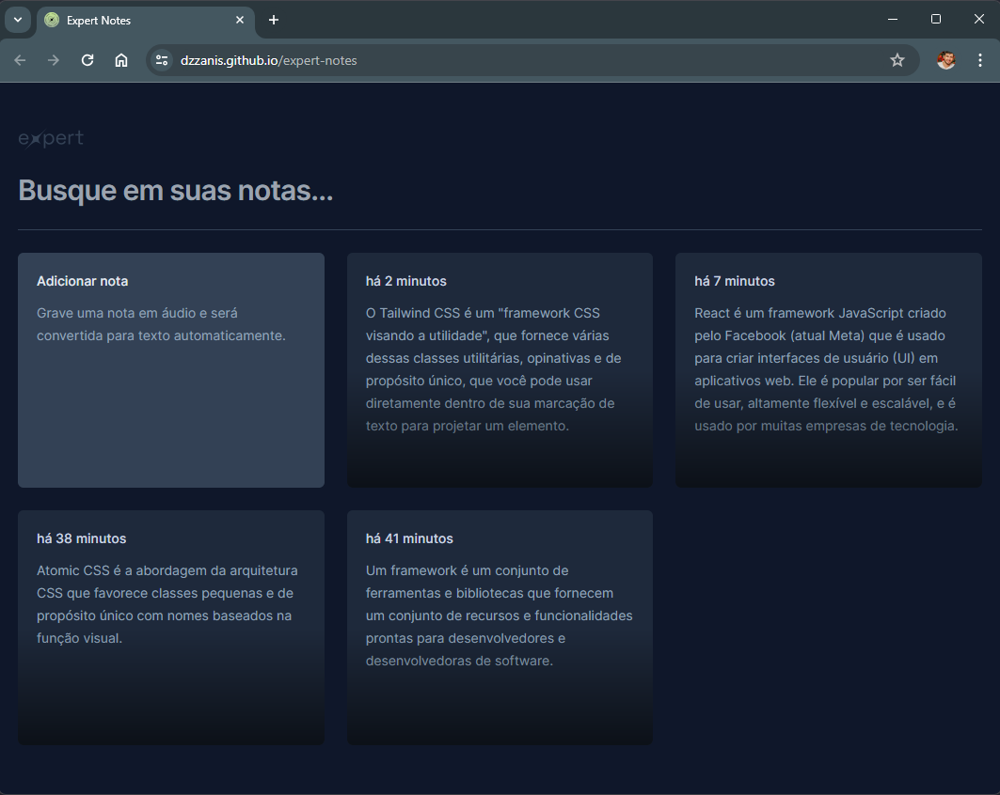

# Expert Notes (React)

Aplicativo de notas, com função de entrada a partir de áudio, convertido automaticamente em texto através do reconhecimento de voz, ou apenas digitando o conteúdo desejado. Conta com as funcionalidades de consulta, alteração e exclusão das notas. E o seu layout é responsivo, para oferencer uma boa usabilidade e experiência tanto em dispositivos mobile quanto em outros tamanhos de tela.

 

> NLW Experts - Trilha React 🚀

Essa aplicação foi desenvolvida durante o bootcamp NLW Experts, trilha React, da Rocketseat, que ocorreu entre 05 e 14 de fevereiro de 2024.

O NLW (Next Level Week) é um evento online de programação na prática da escola Rocketseat.

 

## 🛠 Principais Tecnologias

- React
- TypeScript
- Tailwind
- Radix UI
- SpeechRecognition API
- Vite

 

## Executando

Clique [🔗 aqui](https://dzzanis.github.io/expert-notes) para acessar e visualizar a aplicação.

 

## 🧡 Contato

Diogo Zanis :wave: [LinkedIn](https://www.linkedin.com/in/diogo-zanis-51539a121)
